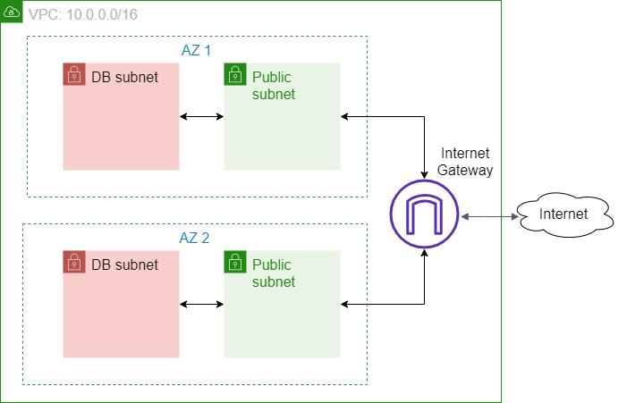
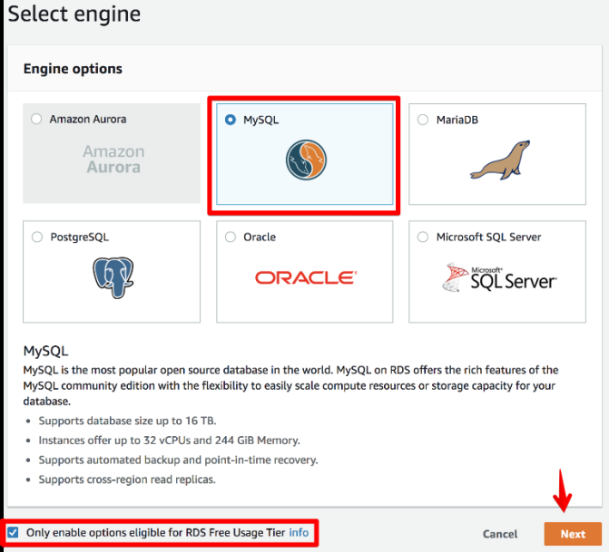
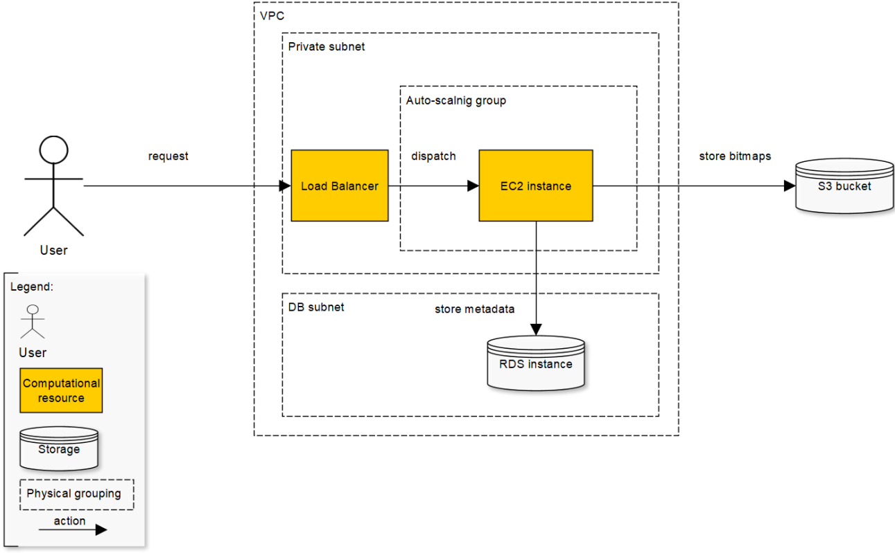

Task 1 - Cloud Formation
========================
1. Create one or more Cloud Formation templates (YAML or JSON based) which would set up a VPC similar to module 5, but simplified: Here:
   
   1. the private subnets and the bastion are not required anymore
   2. the public subnets should not use elastic IPs
   3. use just ordinary public IPs for accessing EC2 instances in the public subnets
   4. ensure that the security groups used by the EC2 instances from the public subnets allow HTTP access only from your IP address
2. Optionally, use the Cloud Formation nesting feature to minimize the amount of template configuration duplication.
3. Create a Cloud Formation template which creates one EC2 instance based on the AMI from module 4 in one of the custom VPC public subnets.
4. Optionally, make the template parameterized so that it’s possible to specify the desired subnet during stack creation.
5. Manually or using a Cloud Formation template, create one EC2 instance in one of the DB subnets and one EC2 instance in one of the public subnets.
6. Ensure that:
   1. the public EC2 instance is accessible from outside VPC and has access to the Internet/DB subnet instance
   2. the DB EC2 instance is not accessible from outside VPC and has not access to the Internet

Task 2 - RDS
============
1. Create an RDS instance in one of the DB subnets of your VPC. **WARNING: Select a free-tier eligible engine option.**
   
2. Update your web application to include the following functions:
   1. download an image by name
   2. show metadata for the existing images
   3. upload an image
   4. delete an image by name
   5. get metadata for a random image
3. After uploading some images, make some SQL queries to the RDS instance bypassing the web-application – for example, from the EC2 instances over SSH.
4. The image metadata should include last update date, name, size in bytes, and file extension.
5. The overall infrastructure should look like this:
   
6. Ensure the following non-functional criteria are met:
   1. the EC2 instance should use IAM roles to access RDS/S3
   2. the EC2 instance should claim the role using the [AWS credentials provider chain](https://docs.aws.amazon.com/sdk-for-java/v1/developer-guide/credentials.html#credentials-default)
7. Optional: use AWS Identity and Access Management (IAM) database authentication to connect your application to the DB instance.
