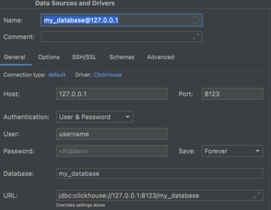
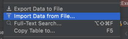

This document contains homework tasks for `BigData`.

**Note**: all tasks should run on Ubuntu or another Linux OS. If you are a big Windows fan you can try on Windows, but it's pain.


Task 1 - Single-node Hadoop
===========================

**Cost**: 20 points.

1. Download latest Hadoop release and set it up manually.
2. Run Hadoop in Single Node regime.
3. Run [Pi example](https://github.com/apache/hadoop/blob/trunk/hadoop-mapreduce-project/hadoop-mapreduce-examples/src/main/java/org/apache/hadoop/examples/pi/DistBbp.java).
4. Make screenshot/screencast and share it with mentor.


Task 2 - Run ClickHouse locally in Docker 
===========================

**Cost**: 30 points.

1. Run ClickHouse locally by colland (below is Mac example, you need to modify it for your OS):
```
    docker run -d -p 8123:8123 -p 9000:9000 \
        -v $HOME/some_clickhouse_database:/var/lib/clickhouse/ \
        -v $HOME/some_clickhouse_database/logs:/var/log/clickhouse-server/ \
        -e CLICKHOUSE_DB=my_database -e CLICKHOUSE_USER=username \
        -e CLICKHOUSE_DEFAULT_ACCESS_MANAGEMENT=1 -e CLICKHOUSE_PASSWORD=password \
        --name some-clickhouse-server --ulimit nofile=262144:262144 clickhouse/clickhouse-server
```

2. Connect to ClickHouse using SQL manager. For example, using DataGrip:



3. Create table ads_data using the following SQL in DataGrip (or any other suitable SQL Manager):

```
create table ads_data
(
    date                  Date,
    time                  DateTime,
    event                 LowCardinality(String),
    platform              LowCardinality(String),
    ad_id                 UInt32,
    client_union_id       UInt32,
    campaign_union_id     UInt32,
    ad_cost_type          LowCardinality(String),
    ad_cost               Float32,
    has_video             Int8,
    target_audience_count UInt64
)
    engine = MergeTree PARTITION BY date ORDER BY (time, ad_id) SAMPLE BY ad_id SETTINGS index_granularity = 8192;
```

4. Upload CSV data file using DataGrip (or any other SQL Manager) to the ads_data table. 
   It can be done in DataGrip by right click on table name and select Import Data from File.

Use this data file for import: [default_ads_data.csv](https://drive.google.com/file/d/1dnUrhf_Ae3_cDJCHYrPrdCTEwbqFoq6u/view?usp=sharing)




5. Calculate number of events per days, count of each ad displayed, number of clicks, number of unique ads and unique campaigns. 
Hint: use the functions - countif, uniqExact. Use LIMIT key word to get less not important rows. 


Task 2 (Optional) - Multi-node Hadoop
==========================

1. Configure cluster with 4 machines with the same Hadoop version.
2. Run Hadoop on 4 machines in Multi-Node regime.
3. Rerun Pi example from the previous task.
4. Make screenshots/screencast of execution process and share it with mentor.


Task 3 (Optional) - Hadoop WordCount with Optimizations
============================================

1. Find your favorite Shakespeare poem and put it into HDFS.
2. Write MapReduce WordCount **\*** program, make JAR and run it via Hadoop (Single Node or cluster, your choice).
3. MR program should:
* filter stop-words (define this list manually);
* change all words to lower case;
* makes pre-reduce optimization;
* have 2 Reducers (one for short words with less than 5 symbols and other one for other words);
* have MR Unit tests for Mapper and Reducer.

**\*** - WordCount is a simple application that counts the number of occurrences of each word in a given input set.

P.S. Look [at this](https://github.com/zaleslaw/Spark-Tutorial/tree/master/Hadoop) if you don't know how to start.


Task 4 (Optional) - Spark WordCount
========================

Write Spark program in Java or Scala for WordCount problem from the previous task.

Provide three solutions via RDD, DataFrames and SparkSQL.

Each solution should:

* read data from the disk;
* cache the data in the Spark memory;
* filter stop-words;
* change all words to lower case;
* print out a calculated result;
* save the calculated result in the file.


Task 5 - Spark and SMS
======================

**Cost**: 20 points.

Find top 5 spam words are not contained in ham messages (use [smsData.txt](smsData.txt)).
Implement your solution via one of approaches (RDD/DataFrames/SparkSQL). Java or Scala as you wish.


Task 6 - Kafka
==============

**Cost**: 30 points.

1. Install Kafka.
2. Create topic `EPAM Secret Messages`.
3. Distribute it over 3 partitions.
4. Add a Producer that generates and sends 1 message every `100 ms` to the topic.
5. Add a Consumer that reads messages every `500 ms`, aggregates them (as you wish) and writes the result into the database via JDBC connection.
6. Run a few consumers. What has happened in Kafka cluster? Discuss with mentor.
