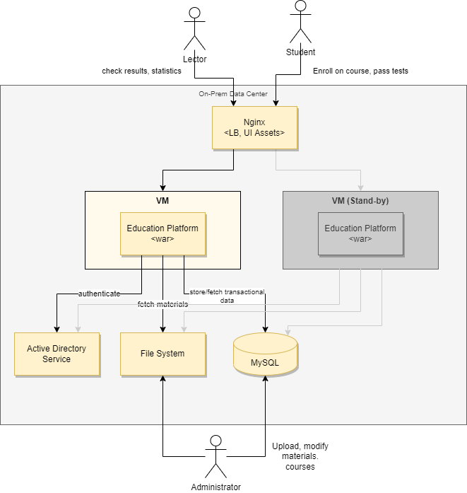

# Architecture Styles & Patterns Practical Task

## Client

National X-City University.

## Request

The existing education platform allows our stydents students to pass our unique Computer Science cources online. Currently we have monolith system along with database and file system deployed in our private campus data center. We also have our identity management solution that allows students to sign-in with their internal accounts. New cources and materials are created manually via direct access to file system and database.
We are willing to expose our platform capabilities across the globe providing access to cources and materials for external students in a free and paid form. We also want to drastically extend number of cources and related materials (video, articles), automate grading process of solutions submitted by students to given problems from the course. As we anticipate a lot of new end users using our platform, we'd like to start platform migration to cloud, we see it as a iterative, smooth process without any business disruption. Apart from existing functionality we'd like to extend the system with new capabilities:
 - we would like to have some aggregated statistics (reporting) 
 - we want to give users recommendations based on their profile.
 - external users might have a way to login with their social network accounts. Administrator should be able to add new courses in a couple of clicks.

 ## Discovery

 Client hired external Solution Architect to come up with new proposal and migration plan. In the first place Solution Architect documented existing Education Platform architecture.

 ### Existing Solution

 

 Solution Architect made some notes related to legacy system:
 1. Monolith Java application being deployed in private data center.
 2. There is Stand-By disaster recovery strategy applied by client.
 3. There is Load Balancer in front of application. The goals are:
  - Switch over to healthy instance in case of any primary server failures.
  - Host static content to be used by frontend side.
 4. Java application is segregated on several layers:
  - Controllers layer
  - Service layer
  - Data Access layer
 5. Education material is stored on file system.
 6. Transaction data is stored within MySQL database.
 7. API is available via REST endpoints.

 Spending a couple of days Solution Architect came up with draft version of new architecture for Education Platform.

 ### Proposed Solution

 

 Solution architect added some key notes highlighting taken decisions:

 1. Monolith application has been broken down to separated component/services that reflect main business entities.
 2. Each component/service has own database storage.
 3. Almost all inter-service communication is implemented via events being sent to central Message Broker.
 4. Components API is never exposed directly but through managed API Gateway being passed through Backend for Frontend components.
 5. New platform API is added iterativly via API Gateway routing rules, legacy platform keeps beings in landscape. 
 6. Courses data being added to database of Courses Management Service also replicated to Courses Search Service (with Search Engine under the hood).
 7. Static content as well as cached materials are stored within content delivery network component (CDN).
 8. Authentication is delegated to Cloud Identity Provider, that under the hood is integrated with legacy AD as well as social networks providing different authentication experience for different types of consumers.  
 9. API Gateway has several configured policies:
  - Policy that imposes limits on the rate at which other applications or services can access platform API (200 RPS per endpoint by default).
  - Policy that enables an application to handle transient failures when it tries to connect to a service or network resource, by transparently retrying a failed operation.
  - Policy that enables caching of rarely changing resources in separate cache component.

 ## Task
 Look carefully on discovery artifacts and do the following:
 1. Try to identify architecture styles being used in legacy and proposed solutions. List benefits and limitations for each of the identified style.
 2. Try to figure out what architecture patterns has been applied within solution. List what are the problem given pattern is intended to solve.

