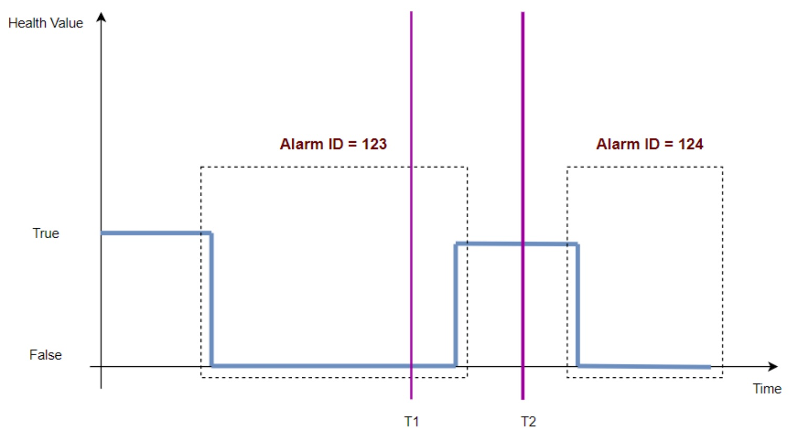
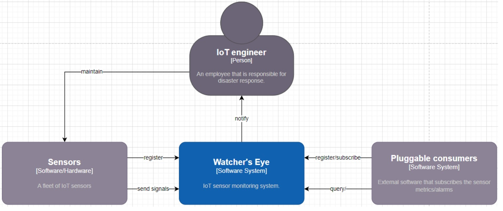
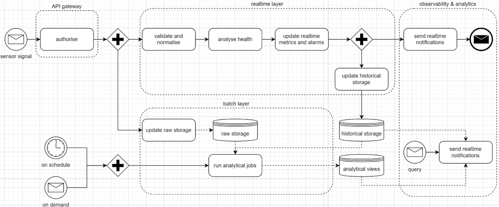
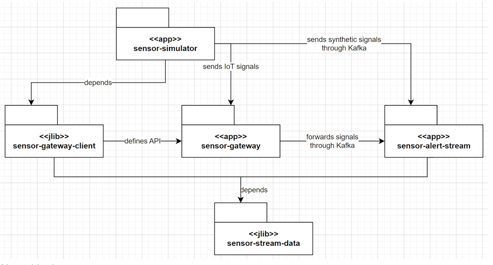
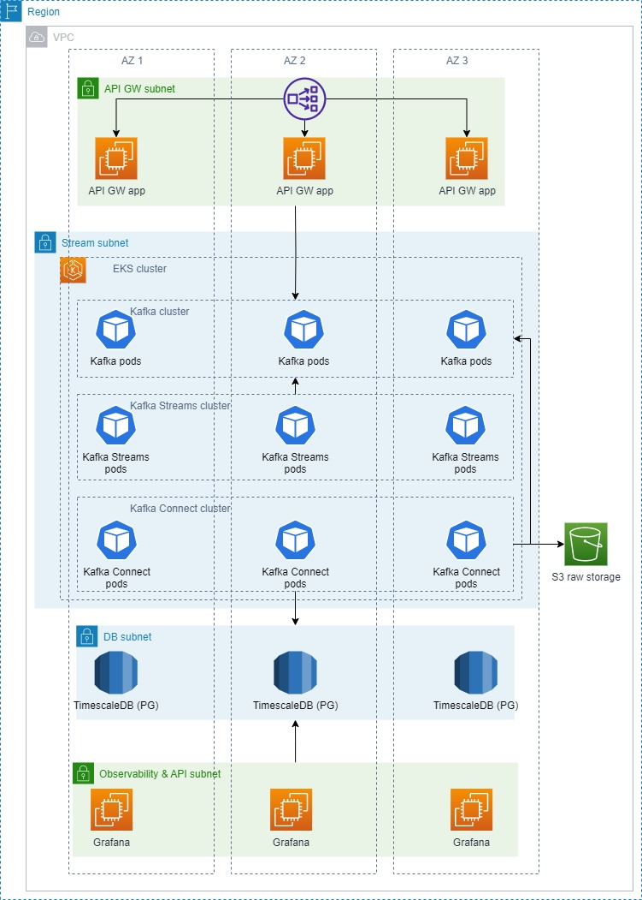

# Requirements
Prepare a POC for an IoT sensor monitoring system:
* Sensor is a physical entity that is installed somewhere in the US
* Sensor has a location (zip code) and a unique ID
* Sensors produce signals with the defined frequency
* Signal has a timestamp when it was created
* Signal has a health value (true | false) ("true" means everything is okay, "false" means there is an issue)
* Signal has a type ("pressure", "temperature", "humidity", etc)
* A sequence of signals should trigger alarms as follows

The solution should answer the following questions:
* How many active alarms are in the specified location(s) and at the specified time with specified type(s): (time, List[zipcode], List[alarmtype]) → alarmsCount
* What is the history of a particular alarm : (alarmId → history)

NFR-s
* Each sensor has up to 5 types of signals
* Each sensor generates 1 signal per second
* There are 100,000 sensors
* Each query should take up to 3 seconds (p95)

# Context view

About this view
* this is a C4 context diagram
* this view shows the boundaries of the responsibilities carried out by the system
* also, it shows what actors (users and external systems) interact with the system

Key elements
* fleet of IoT sensors
  * each sensor must register/be registered before sending any data
  * on registration, sensor is assigned a unique ID which must submit with every signal
* “Watcher’s Eye”
  * is the system under development
  * it ingests incoming signals and is able to provide realtime alarms and also serve historical queries based on them
* IoT engineers
  * who monitor realtime alarms issued by Watcher’s Eye
  * who are responsible for taking decisions on sensor maintenance
* external consumers
  * which are typically (optional) integrations with partner software systems
  * they can subscribe to realtime alarms
  * or they can issue historical queries for analytical purposes

# Process view

About this view
* this a BPMN 2.0 diagram
* it shows the essential data flows in the system

Key elements
* API gateway - a component that mediates IoT sensors-to-platform communication
* realtime layer - a component(s) dedicated to processing IoT signals in realtime and generating metrics
* raw storage - a BLOB storage for all signals that managed to get through the API GW
* batch layer - a component(s) that runs on schedule or on demand to do more accurate and complicated analytics on both raw data and realtime metrics
* analytical views - DB(s) holding the results of batch layer processing
* observability & analytics API - APIs exposed to the other internal systems and external consumers

*ARC 1* - reference architecture choice
* although this view doesn’t explicitly show any components besides storages, it’s clear that the system is a perfect candidate for [Lambda architecture](https://www.databricks.com/glossary/lambda-architecture)

*ARC 2* - need for an API GW
* it’s clear that something should mediate the interaction between the system and IoT sensors to avoid such threats as DDoS attacks
* a reasonable choice here is to have an API GW component in front

# Modules view

About this view
* this is a UML package diagram
* this view shows the implementation units of the system POC
* also, it demonstrates dependencies among the units as annotated associations to aid planning

Key elements
* sensor-stream-data - models that represent signals sent and different processing stage results
* sensor-gateway - an application that implements the API GW (see the Process view)
* sensor-alert-stream - an application that implements the realtime layer processing (see the Process view)
* sensor-gateway-client - a library that implements an API client abstraction for the API GW
* sensor-simulator - an application that simulates the activity of IoT sensors for testing purposes

*MOD 1* - tech choice for sensor-gateway
* Spring Boot 2.0 is chosen as it enables fast implementation of REST API services with all the required features included out-of-box (logging, security integrations, etc).

*MOD 2* - tech choice for sensor-alert-stream
* Kafka Streams is chosen as the foundation for implementing all the signal processing steps. The reason is that it’s lightweight, vendor-agnostic, scalable, testable, and has a rich set of processing primitives out-of-box (sorting, deduplication, windowing, etc).

*MOD 3* - need in sensor-simulator
* It was decided to introduce the additional sensor-simulator Spring Boot application and deploy it on dev/test environments to aid testing activities.
* The reason is to have a controllable workload generator and avoid the complexity and extra cost of dealing with real IoT devices in early development stages.

# Deployment view

About this view:
* this is an AWS diagram
* this view demonstrates an AWS infrastructure for deploying the POC

Key elements
* the system resides within one VPC which resides within one region
* API GW app - the API GW nodes
* Kafka pods - hold Kafka topics for streaming IoT signals and metrics
* Kafka Streams pods - process the data from the topics and metrics
* Kafka Connect pods - connectors that translate raw input signals to the raw storage and metrics data to the time series DB
* TimescaleDB - final storage for the realtime metrics
* Grafana - nodes holding the observability and query tools

*INFRA 1* - subnets
* to be able to manage security rules and internal networking easier, all major component layers are assigned their own subnets

*INFRA 2* - availability
* for high availability, each of the subnets spans 3 availability zones

*INFRA 3* - raw storage
* for cost efficiency, availability, scalability, and durability reasons, S3 is chosen for the raw storage

*INFRA 4* - metrics storage
* Postgres was chosen for the metrics storage for cost efficiency, good tools compatibility, and maturity + because the metrics model has a well-defined stable structure
* TimescaleDB was chosen to extend Postgres’ time series processing capabilities to boost metrics processing performance
* AWS RDS was chosen as the container for Postgres since it’s a proven solution for deploying Postgres in AWS

*INFRA 5* - observability platform
* Grafana was chosen for the observability platform because of its open-source status, maturity, wide range of data source and sinks integrations
