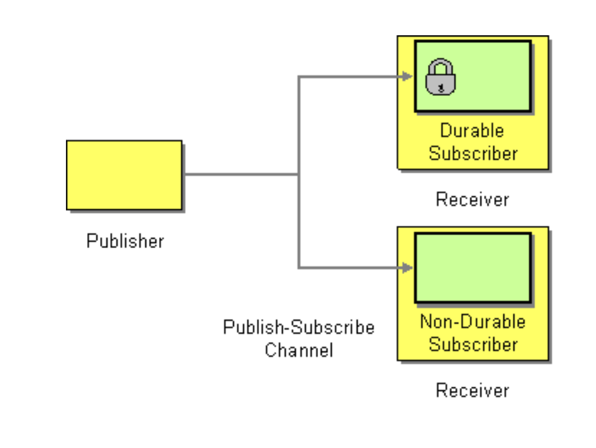
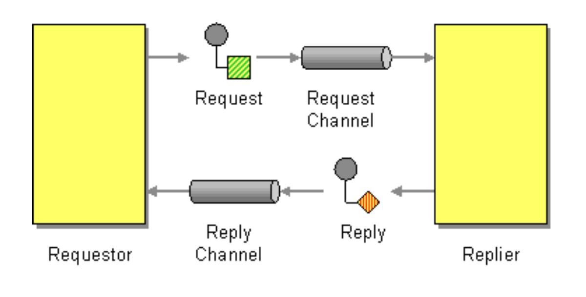
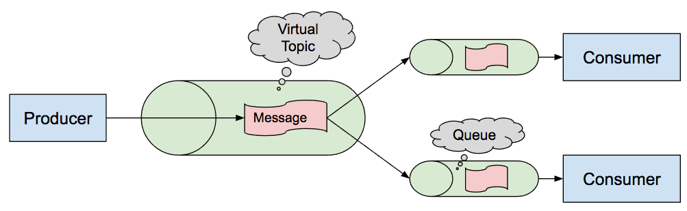

# ActiveMQ

## Prerequisites:

Download and install classic ActiveMQ.

## Practical Task:

I. Implement publish/subscribe interaction between two applications. Check durable vs non-durable subscription.

II. Implement request-reply interaction between two applications using a temporary queue in ActiveMQ.

III. Implement subscriber scaling, i.e. create n subscribers to a topic with the same ClientID (see Virtual Topics in ActiveMQ)
Note. Implement the subscriber as a standalone application and show how it works when we add or remove subscribers.

## References

1. [ActiveMQ Documentation](https://activemq.apache.org/components/classic/documentation)
2. [Spring: Messaging with JMS](https://www.linkedin.com/learning/spring-messaging-with-jms)
